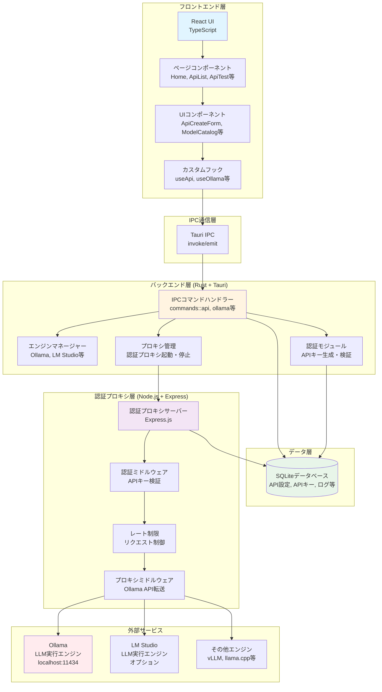
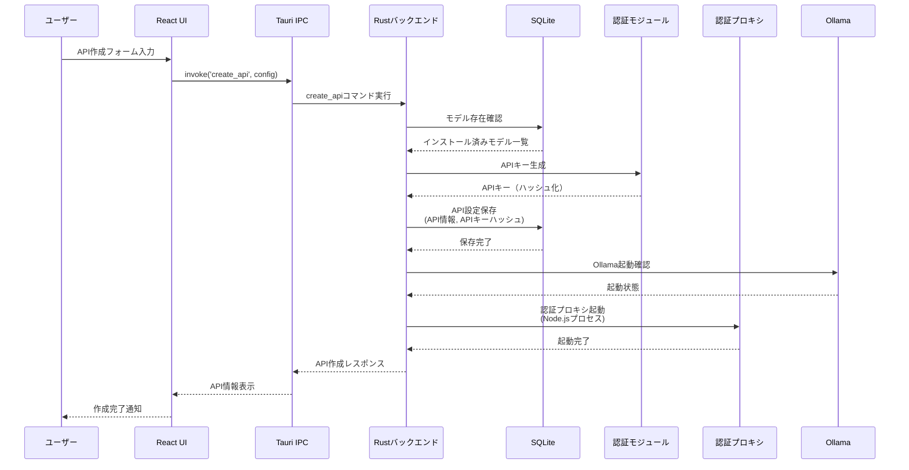
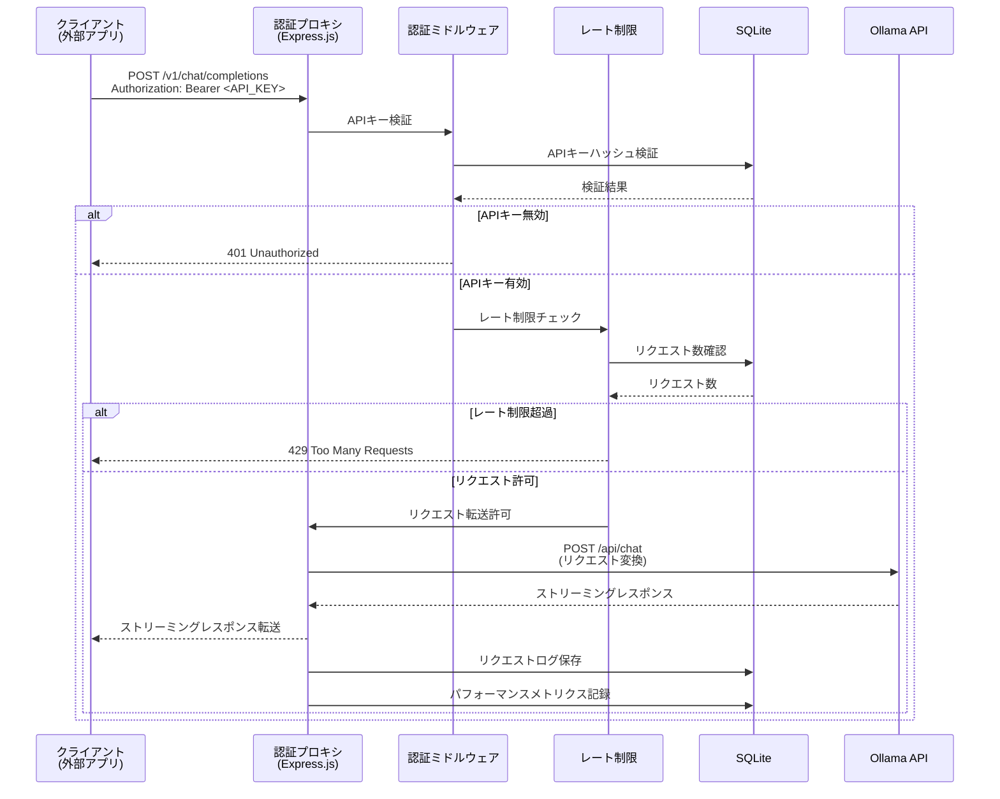
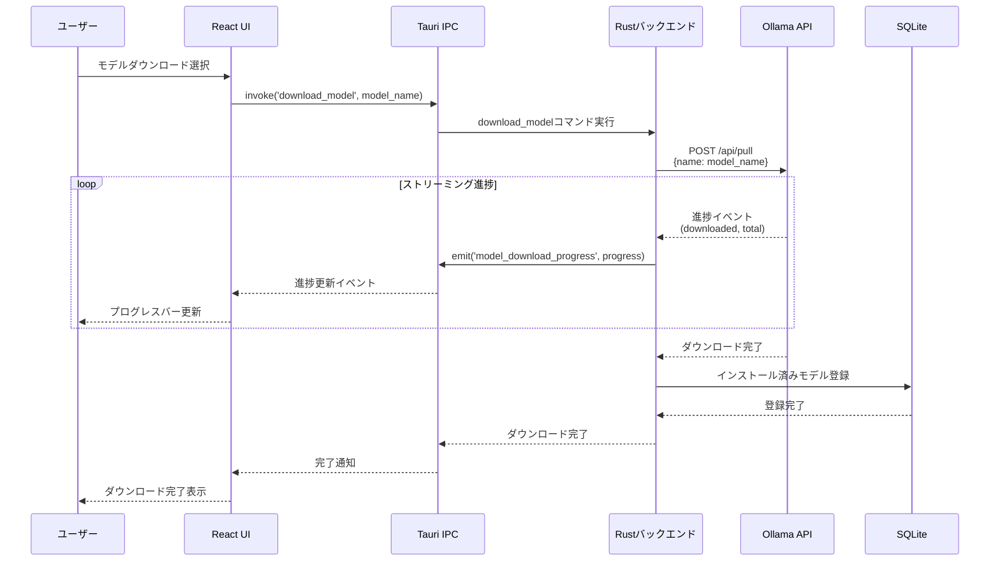
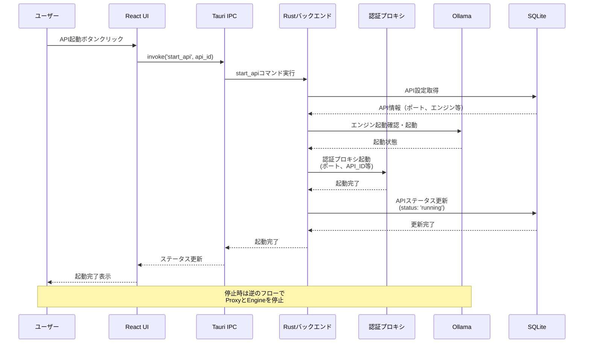
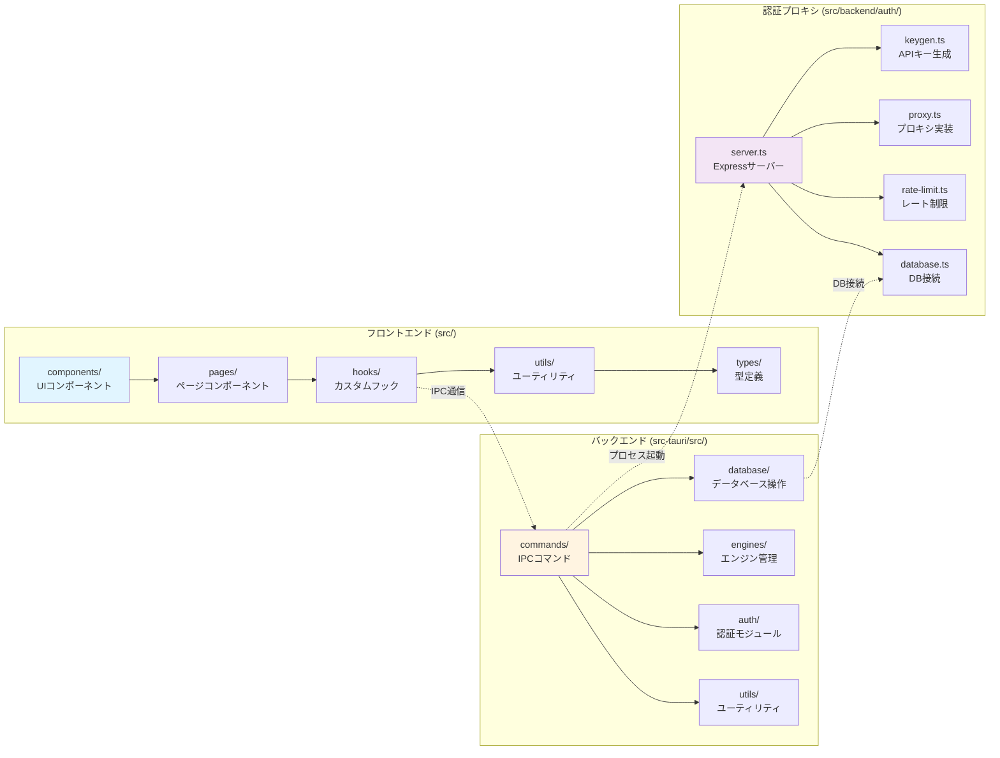
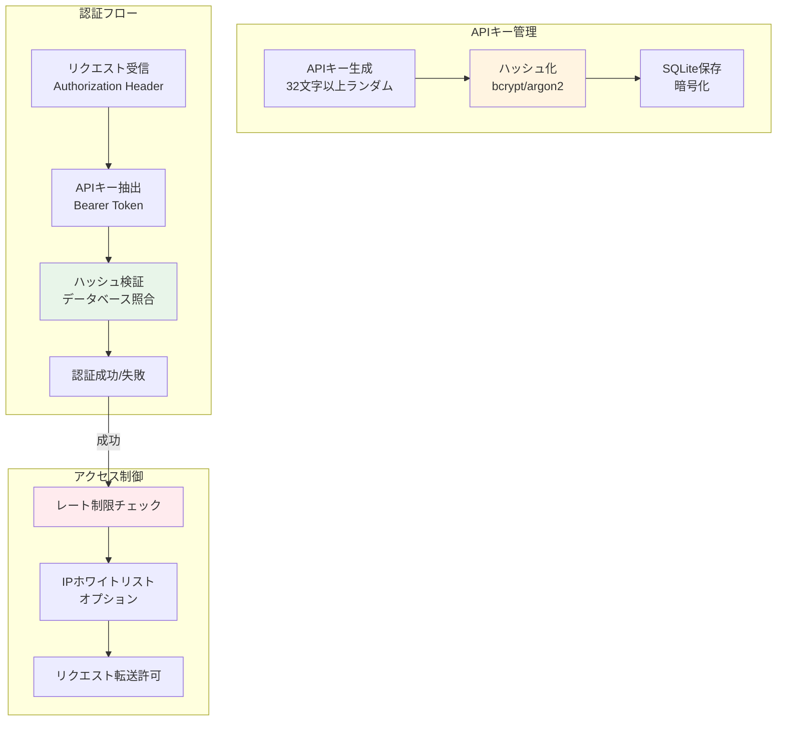
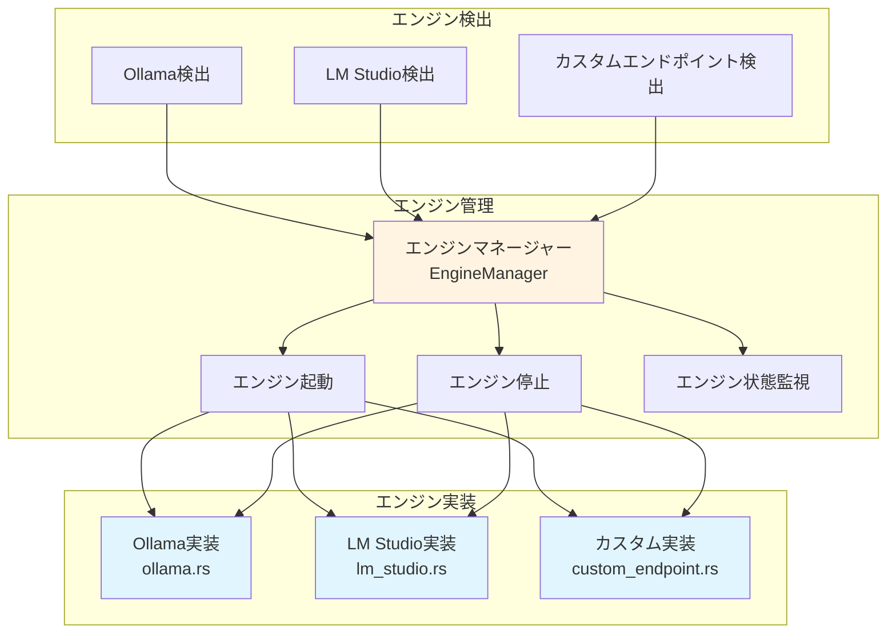
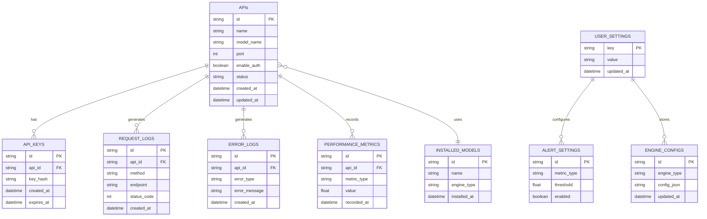

# FLM システムアーキテクチャとデータフロー図

このドキュメントでは、FLMプロジェクトのシステムアーキテクチャとデータフローをMermaidダイアグラムで可視化しています。

---

## システムアーキテクチャ図

---

## データフロー図

### 1. API作成フロー

### 2. API利用フロー（チャット）

### 3. モデルダウンロードフロー

### 4. API起動・停止フロー

---

## モジュール構成図

---

## セキュリティフロー図

---

## エンジン管理フロー図

---

## データベーススキーマ関係図

---

## まとめ

このドキュメントでは、FLMプロジェクトの主要なアーキテクチャとデータフローを可視化しました。

### 主要な特徴

1. **3層アーキテクチャ**: フロントエンド（React）、バックエンド（Rust/Tauri）、認証プロキシ（Node.js/Express）
2. **IPC通信**: Tauri IPCによる安全なフロントエンド-バックエンド通信
3. **認証プロキシ**: APIキー検証とレート制限を提供する中間層
4. **マルチエンジン対応**: Ollama、LM Studio、カスタムエンドポイントに対応
5. **データ永続化**: SQLiteによる設定、ログ、メトリクスの保存

### データフローの要点

- **API作成**: UI → IPC → バックエンド → DB保存 → プロキシ起動
- **API利用**: クライアント → 認証プロキシ → 認証 → レート制限 → Ollama → レスポンス
- **モデル管理**: UI → IPC → バックエンド → Ollama API → 進捗通知 → DB保存

---

**最終更新日**: 2025年

