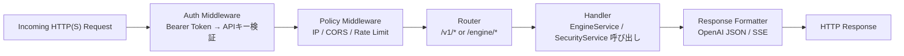

# FLM Proxy Specification
> Status: Canonical | Audience: Proxy/Network engineers | Updated: 2025-11-18

## 1. 役割

Axum/Hyper ベースの HTTP(S) プロキシ。以下の責務を担う:

1. リクエスト受付 (`/v1/*`, `/engine/*`)
2. 認証 (Bearer API Key)
3. ポリシー適用 (IPホワイトリスト / CORS / レート制限)
4. ルーティングおよびリクエスト変換
5. EngineService 呼び出し
6. OpenAI 互換レスポンス / SSE の生成

## 2. リクエストフロー



## 3. ルーティングルール

| Path                     | ハンドラ概要                                                     |
|-------------------------|------------------------------------------------------------------|
| `POST /v1/chat/completions` | OpenAI 互換チャット。リクエストを `ChatRequest` にマッピングして `EngineService::chat/chat_stream` を呼ぶ。未対応パラメータ（例: `logit_bias`）は warning ログのみ。Phase1/2 は `model` に `flm://engine/model` 形式を必須とし、異なる形式や欠落時は 400 `invalid_model` |
| `GET /v1/models`        | `EngineService::list_models` → モデルIDを `flm://{engine_id}/{model}` 形式に正規化し OpenAI 互換 JSON へ整形 |
| `POST /v1/embeddings`   | `EngineService::embeddings` を呼び、OpenAI 互換で返却           |
| `POST /engine/:id/*`    | エンジン固有エンドポイントへのパススルー（ヘッダ制限付き）      |

### `/v1/chat/completions`

* リクエスト変換: OpenAI JSON → `ChatRequest`
* Phase1/2 は `model` に `flm://{engine_id}/{model}` 形式を必須とする。欠落または異なる形式の場合は 400 `invalid_model`
* モデル名が `flm://` 形式の場合のみ internal `ChatRequest.model_id` / `engine_id` に分解
* ストリーミング: `stream: true` の場合は `EngineService::chat_stream` を呼び、SSEとして返却
* fallback ルール:
  - 温度指定 (`temperature`) が対象エンジンで未サポート → 設定を無視し warning を `stderr` ログ
  - `n > 1` は vLLM のみサポート。その他では `n=1` に強制
  - `response_format` 等が未知の場合は 400 (unsupported_parameter)

```rust
async fn chat_stream_handler(...) -> impl IntoResponse {
    let core_req = map_openai_to_core(openai_req)?;
    let stream = engine_service.chat_stream(core_req)?;

    let sse = stream.map(|chunk_res| match chunk_res {
        Ok(chunk) => Ok(Event::default().data(map_core_chunk_to_openai(chunk))),
        Err(e) => Err(e),
    });

    Sse::new(sse)
}
```

### `/engine/:engine_id/*`

* 可能な限り単純プロキシ（FLM の責務外の操作をユーザーが行うことを許容）
* ただし Forward 先ホストは EngineService が検出済みのホストのみ

## 4. Streaming の扱い

| エンジン | Proxy での処理                                         |
|----------|-------------------------------------------------------|
| vLLM / LM Studio / llama.cpp (OpenAI互換) | chunked response を透過（SSEヘッダと `data:` プレフィックスのみ追加） |
| Ollama   | Engineアダプタで `ChatStreamChunk` に変換 → Proxy が OpenAI SSE 形式に整形（`delta.content` にマッピング、`done` 時に `[DONE]`） |

## 5. 順序と責務境界

1. 認証 (APIキー → security.db)
2. ポリシー (IP / CORS / RateLimit)
3. ルーティング (/v1/* or /engine/*)
4. Handler 内で EngineService / SecurityService を呼び、結果を OpenAI形式に整形
5. レスポンス変換（モデルID / SSE chunk / usage）

この順序を崩すと不正アクセスやリソース浪費が発生するため厳守。

## 6. TLS / HTTPS モード

| モード          | 説明                                                      |
|-----------------|---------------------------------------------------------|
| `local-http`    | HTTPのみ。ローカルネットワーク限定（ファイアウォール必須） |
| `dev-selfsigned`| 自己署名証明書で HTTPS 提供。一般ユーザーがドメイン不要で外部公開する際の推奨モード |
| `https-acme`    | ACME (Let’s Encrypt など) で証明書を取得し HTTPS 提供（カスタムドメイン所有者向け） |

CLI のデフォルトは `local-http`（ローカル検証向け）とし、インターネット公開を行う場合の推奨モードは `dev-selfsigned` とする。これによりドメインを持たない利用者でも自己署名HTTPSで安全に外部公開できる。ACMEモードはカスタムドメインを所有しているユーザーが必要に応じて有効化する。`--port` で指定した値は HTTP 用ポートとして扱い、HTTPS は `port + 1` をデフォルトとする（例: 8080/8081）。

* 設定は `ProxyConfig` に集約 (`core` 側で管理)
* ACME 証明書は `security.db` にパスと更新日時を保存

## 7. エラー・ログポリシー

* すべてのリクエストに `request_id` を付与
* ログ項目: timestamp, request_id, client_ip, api_key_id, endpoint, engine_id, latency_ms, status, error_type
* SSE ストリーム中のエラーは `data: {"error": ...}` として送出し、最後に `done` イベントで終了

## 8. Fallback ルール（暫定）

| パラメータ | サポートエンジン | 非対応時の挙動 |
|------------|------------------|----------------|
| `temperature` | 全エンジン | 受け入れるが範囲外の場合 clamp。未実装エンジンはログ警告＋デフォルト値 |
| `n` | vLLM のみ | その他は `n=1` 強制、warning |
| `logit_bias`, `presence_penalty`, `frequency_penalty` | 未サポートエンジン多数 | warning を出しつつ無視 |
| `stop` | Ollama/vLLM | llama.cpp 等未対応は無視 |

## 9. セキュリティポリシー JSON の前提

Proxy / UI / CLI は `SecurityPolicy.raw_json` に以下のキーが存在する前提で動作する（省略時は無効扱い）:

```jsonc
{
  "ip_whitelist": ["127.0.0.1"],
  "cors": { "allowed_origins": ["https://example.com"] },
  "rate_limit": { "rpm": 60, "burst": 10 }
}
```

- `ip_whitelist`: CIDR/IPv4/IPv6 文字列の配列。空または省略で無効。
- `cors.allowed_origins`: 許可Origin配列。空で `*`。
- `rate_limit`: `rpm`（per API key）と任意の `burst`。省略でレート制限無効。
- Phase1/2ではグローバルポリシーID `"default"` のみを参照し、Proxy は常にこのポリシーをロードして適用する。

## 10. 未決事項

- `/v1/audio/*` 等の将来 API は `EngineCapabilities` を確認して動的にサポート
- ProxyService でのホットリロード（設定変更を再起動無しで反映するか）

