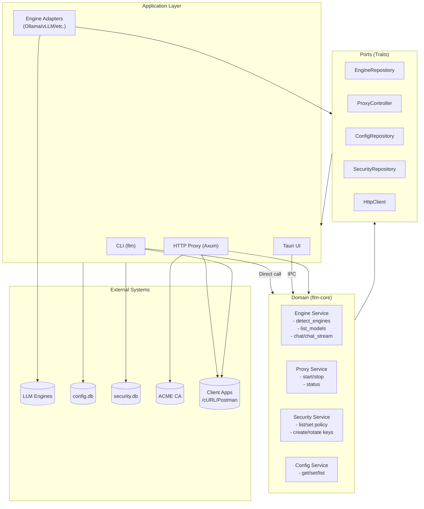

# FLM Architecture Diagram
> Status: Canonical | Audience: All contributors | Updated: 2025-11-20

以下のマーメイド図は Rust コア / Adapters / External Dependencies の関係と依存方向を示します。

```mermaid
flowchart TD
    subgraph Domain["Domain (flm-core)"]
        EnginesSvc["Engine Service\n- detect_engines\n- list_models\n- chat/chat_stream"]
        ProxySvc["Proxy Service\n- start/stop\n- status"]
        SecuritySvc["Security Service\n- list/set policy\n- create/rotate keys"]
        ConfigSvc["Config Service\n- get/set/list"]
    end

    subgraph Ports["Ports (Traits)"]
        EngRepo["EngineRepository"]
        ProxyCtrl["ProxyController"]
        ConfigRepo["ConfigRepository"]
        SecRepo["SecurityRepository"]
        HttpPort["HttpClient"]
    end

    subgraph Adapters["Application Layer"]
        CLI["CLI (flm)"]
        UI["Tauri UI"]
        ProxyAdapter["HTTP Proxy (Axum)"]
        EngineAdapters["Engine Adapters\n(Ollama/vLLM/etc.)"]
    end

    subgraph        External["External Systems"]
        Engines[(LLM Engines)]
        ConfigDB[("config.db")]
        SecurityDB[("security.db")]
        ACME[(ACME CA)]
        Clients[(Client Apps\n/cURL/Postman)]
    end

    CLI -->|Direct call| Domain
    UI -->|IPC| Domain
    ProxyAdapter --> Domain

    Domain --> Ports
    Ports --> Adapters
    EngineAdapters --> Ports

    EngineAdapters --> Engines
    ProxyAdapter --> ACME
    ProxyAdapter -->Clients
    CLI --> Clients

    Adapters --> ConfigDB
    Adapters --> SecurityDB
```

